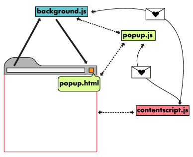
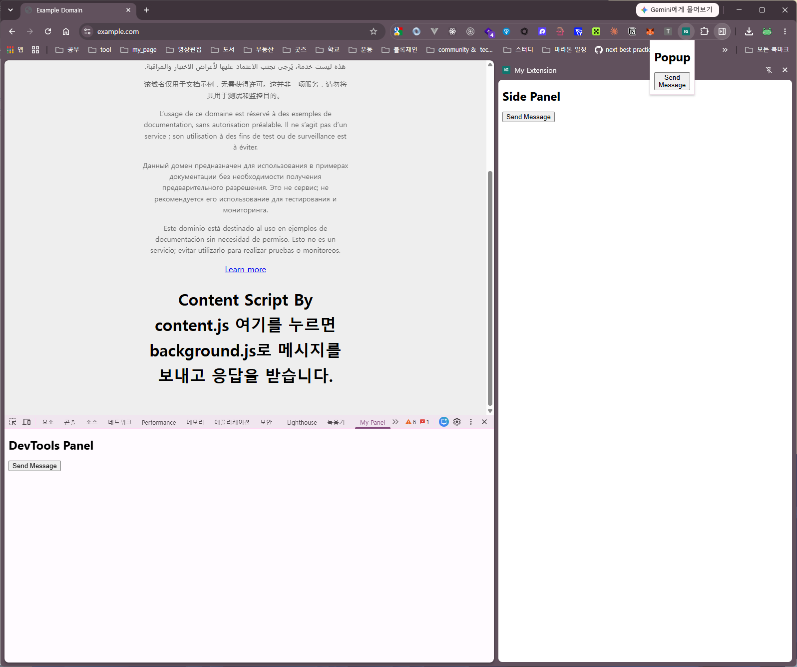

# chrome extension

### architecture



sidepanel, devtools는 popup과 같은 역할 수행

content는 현재 브라우저에 표시된 화면에서 동작하는 js, manifest.json의 match를 이용하여 원하는 도메인에 접속한 페이지에서만 content를 동작시킬 수 있음

background는 확장 프로그램이 활성화 되지 않더라도 동작하는 js

```
/
├── manifest.json
├── background.js
├── content.js
├── popup/
│   ├── popup.html
│   └── popup.js
├── sidepanel/
│   ├── sidepanel.html
│   └── sidepanel.js
├── devtools/
│   ├── devtools.html     # DevTools 패널을 등록하는 진입점
│   ├── devtools.js
│   ├── panel.html        # 실제 패널 UI
│   └── panel.js
├── options/
│   ├── options.html
│   └── options.js
└── icons/
```



만약 크롬 확장프로그램을 눌렀을 때 popup이 아닌 side panel이 열리게 하려면 manifest.json에서 action.default_popup을 제거하고 background.js에 다음과 같이 openPanelOnActionClick을 true로 설정

```js
chrome.sidePanel.setPanelBehavior({
  openPanelOnActionClick: true
});
```

### message

```
Popup·Side Panel·DevTools → Background
             chrome.runtime.sendMessage()

Content → Background
             chrome.runtime.sendMessage()

Background·Popup·Side Panel → 웹페이지의 Content Script
            대상 탭 ID를 확보하여 chrome.tabs.sendMessage(tabId, ...)로 전송
            현재 활성 탭이 대상이라면 chrome.tabs.query()로 조회

DevTools Panel → 검사 중인 웹페이지의 Content Script
            chrome.devtools.inspectedWindow.tabId로 검사 대상 탭 ID 확인
            chrome.tabs.sendMessage(tabId, ...)로 전송
```

Content에서 확장 화면(Popup·Side Panel·DevTools)으로 직접 메시지를 보내지 않는다. 

확장 화면은 열려 있을때 활성화 되므로 활성화 중인 background와 통신을 수행함.

### storage

* local

local은 key: value를 직접 지우거나 확장 프로그램이 삭제될 때 삭제됨

```js
await chrome.storage.local.set({ key: value });
console.log("Value is set");
const result = await chrome.storage.local.get(["key"]);
console.log("Value is " + result.key);
```

* sync

```js
await chrome.storage.sync.set({ key: value });
console.log("Value is set");
const result = await chrome.storage.sync.get(["key"]);
console.log("Value is " + result.key);
```

* session

세션 스토리지는 확장 프로그램이 로드되는 동안 데이터를 메모리에 보관됨

확장 프로그램을 사용 중지, 다시 로드, 업데이트, 브라우저를 다시 시작하면 저장소가 삭제됨

```js
await chrome.storage.session.set({ key: value });
console.log("Value is set");
const result = await chrome.storage.session.get(["key"]);
console.log("Value is " + result.key);
```

* storage observe

```js
chrome.storage.onChanged.addListener((changes, namespace) => {
  for (let [key, { oldValue, newValue }] of Object.entries(changes)) {
    console.log(
      `Storage key "${key}" in namespace "${namespace}" changed.`,
      `Old value was "${oldValue}", new value is "${newValue}".`
    );
  }
});
```